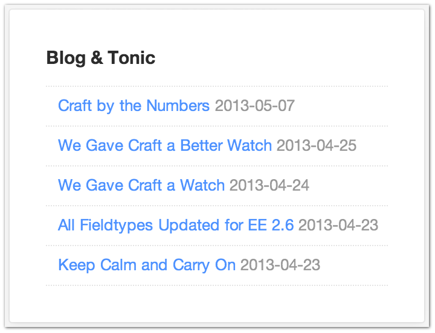

Feed
====

The Feed Widget lets you easily add an RSS feed to your dashboard.

  The feed widget includes 3 options:

* URL: The URL to your RSS feed
* Title: The title of your RSS feed
* Limit: How many entries to show

By default, Craft includes a Feed Widget pointing to the `Pixel & Tonic blog <http://pixelandtonic.com/blog>`_, where you’ll be able to stay on top of the latest news and announcements from Pixel & Tonic.

