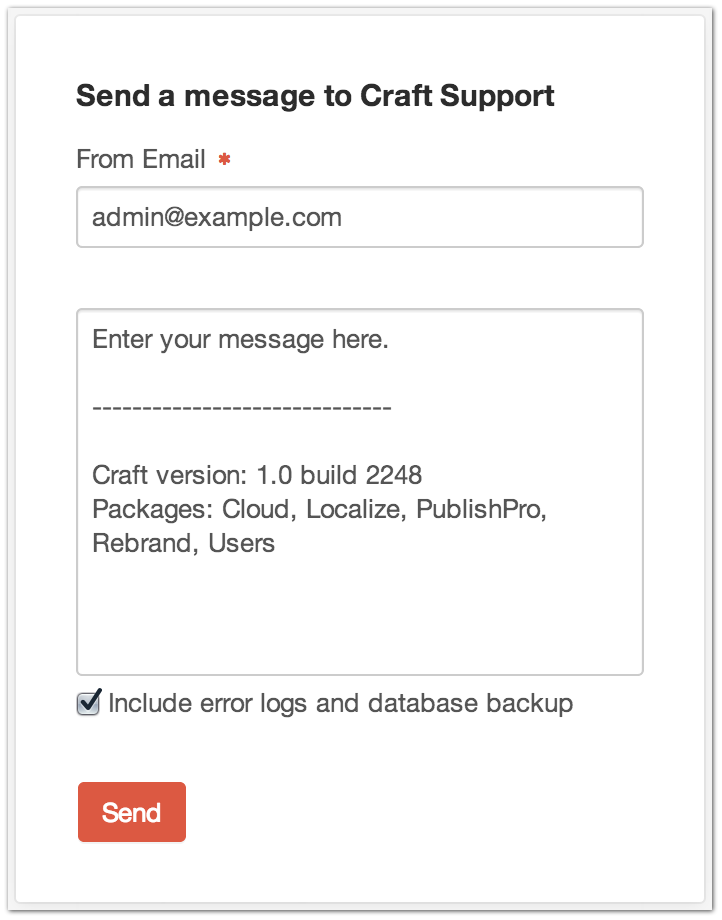

Get Help
========

+---------------------------------------------------------------------------------------------------------------------------------------------------------------------------------------------------+-----------+
| Sometimes bad things happen to good software… don’t let that slow you down.                                                                                                                       | |gethelp| |
|                                                                                                                                                                                                   |           |
| The Get Help Widget allows you to open a support ticket with `Pixel & Tonic <http://pixelandtonic.com>`_ directly from your dashboard.                                                            |           |
|                                                                                                                                                                                                   |           |
| Simply fill in your email and a description of the problem you’re experiencing.  Your Craft version, build and the :ref:`packages <packages>` you have installed are sent along with the ticket.  |           |
|                                                                                                                                                                                                   |           |
| You can optionally choose to send in your Craft log files as well as a database backup.  Including this information allows us to help debug your issue and resolve your ticket faster.            |           |
+---------------------------------------------------------------------------------------------------------------------------------------------------------------------------------------------------+-----------+

