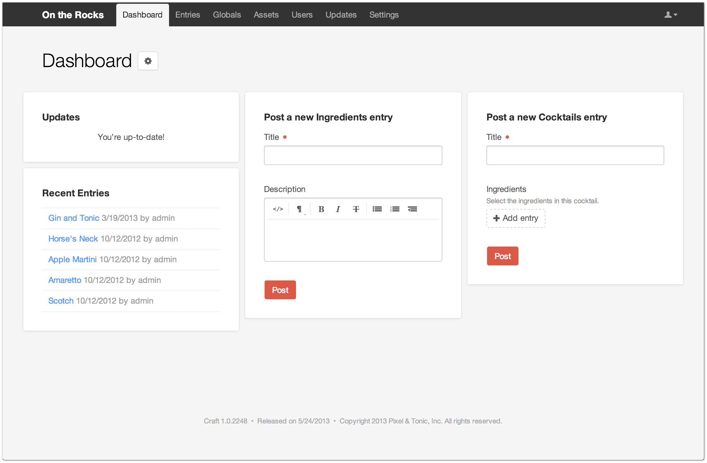
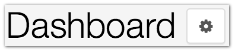

Dashboard
=========

Craft’s dashboard provides a central place to interact with your site.

Widgets live on the dashboard.

They allow you to do things such as post new entries, view recently posted entries, see if new updates are available, browse RSS feeds and send a message directly to Craft support.

+------------+----------------------------------------------------------------------------------------------------------------------------------------------+
| |settings| | You can add new Widgets to the dashboard, remove ones you don’t need and reorder their positions through the settings icon on the dashboard. |
+------------+----------------------------------------------------------------------------------------------------------------------------------------------+

Craft includes five widgets with a fresh installation.

.. toctree::
   :titlesonly:

   quick-post
   recent-entries
   feeds
   update
   get-help
