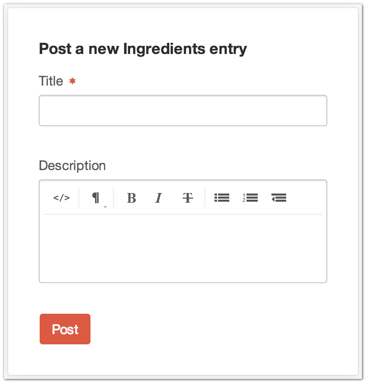
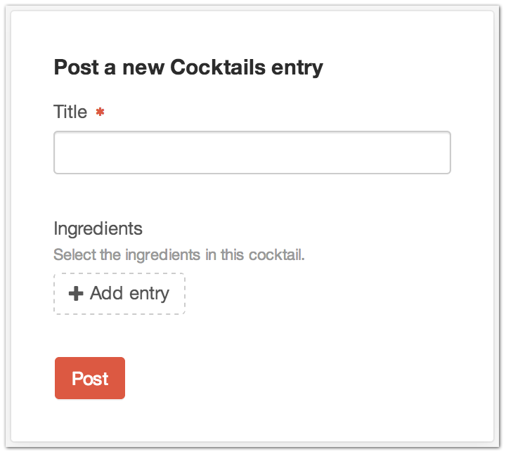

Quick Post Widget
=================

+--------------+-------------------------------------------------------------------------------------------------------------------+--------------+
| |quickpost1| | You‘re in a hurry… we get it.                                                                                     | |quickpost2| |
|              |                                                                                                                   |              |
|              | Don’t waste precious time clicking those two extra times to post a new entry.  Do it straight from the dashboard. |              |
|              |                                                                                                                   |              |
|              | You can choose which Section to post to and which fields show up on the dashboard from the Widget’s setting page. |              |
+--------------+-------------------------------------------------------------------------------------------------------------------+--------------+

--------

Settings
--------

.. |settings| image:: ../../_static/images/diving-in/dashboard/quickpost-settings.png
   :alt: Quick Post Widget Settings
   :width: 250px
   :scale: 100%

+----------------+------------------------------------------------------------------------------------+
| |settings|     | **Section**: The Section you want to post new entries to                           |
|                |                                                                                    |
|                | **Fields**: The Fields from the selected Section you want to display on the Widget |
+----------------+------------------------------------------------------------------------------------+
