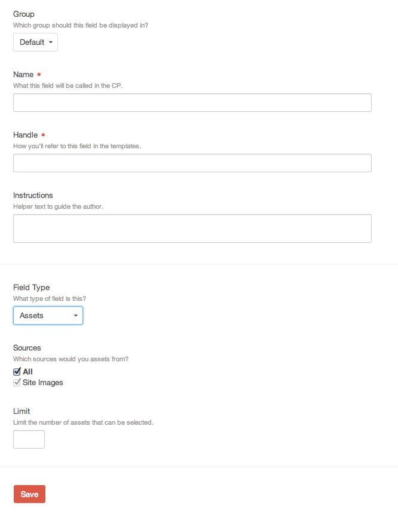

Assets
==========

The Assets fieldtype allows you to store and reference media content in Craft.  Assets can be used to store PDFs, images, movies, sound files, and other media types.

The Assets fieldtype has these settings:

Sources
    What sources would you choose assets from?

Limit
    Limit the number of selectable assets

Entry Page
----------

Image

Template
----------

.. code-block:: html

    
        
    
