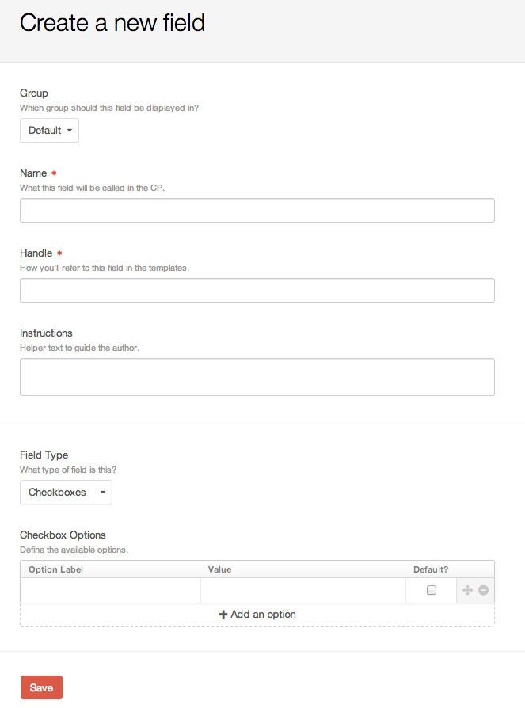
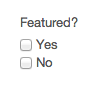

Checkboxes
==========

The Checkboxes fieldtype allows you to create a grouping of checkboxes to include on your entry form.

Settings
--------

You can set an Option Label, a Value, and check if that option is the default value.

You can also drag and drop your checkbox items to control the row order presented when modifying content.

Entry Page
----------

Your checkbox fieldtype will appear on your entry form with the options you created in the order you set them.  The below shows how a Featured checkbox would appear on the entry form:

Template
--------

