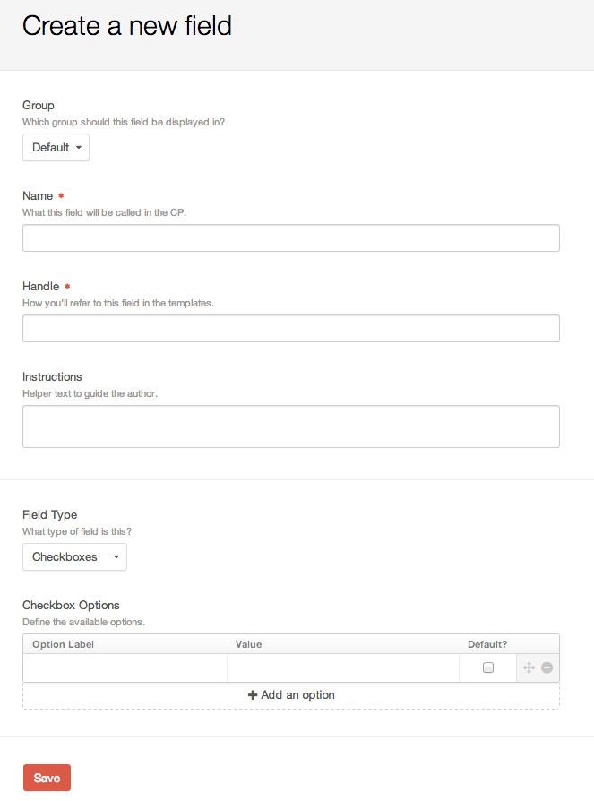
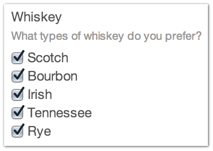

Checkboxes
=======

The Checkboxes fieldtype allows you to create a grouping of checkboxes to include on your entry form.

Settings
--------

[BRAD - SCREENSHOT update Checkbox Settings]

Option Label
    The friendly label for your Checkbox option

Value
    The value= when selecting this field

Default
    Is this the option selected by default when loading the entry form?

You can drag and drop your checkbox items to control the row order presented when modifying content.

[BRAD - SCREENSHOT of the re-order and delete icons]

Entry Page
----------

Your checkbox fieldtype will appear on your entry form with the options you created in the order you set them.  The below shows how a Featured checkbox would appear on the entry form:

[BRAD - SCREENSHOT update for Checkbox output on entry form] 

Template
--------

