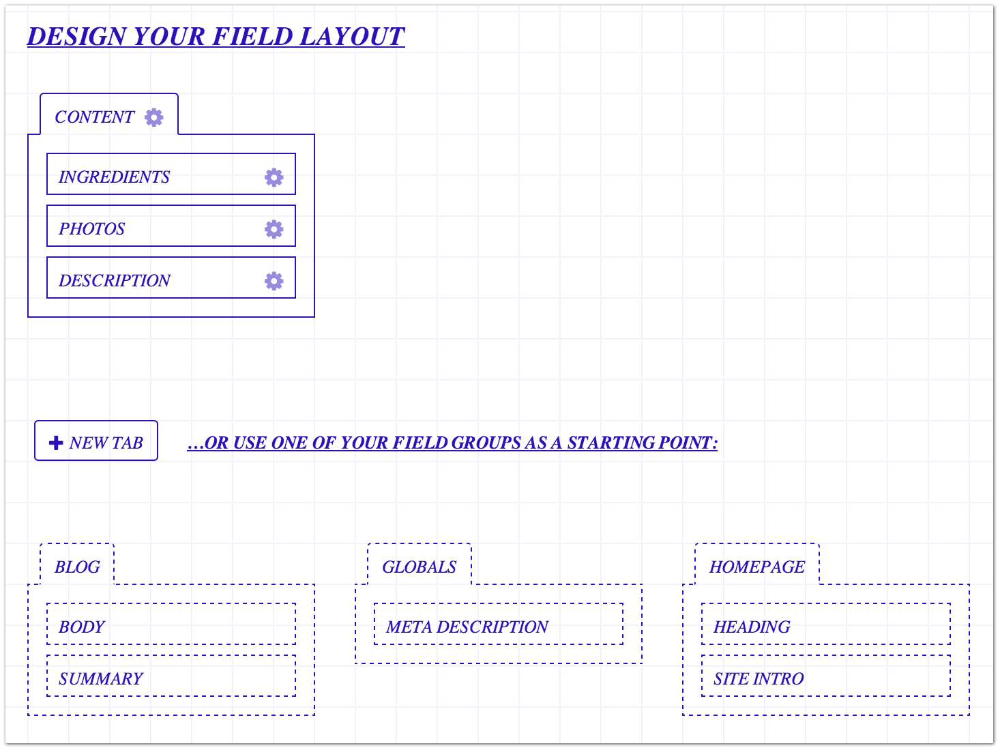

Fields
======

In Craft, all of your site’s content is entered into **Fields**.  They are the building blocks of your website.

Fields are created globally, and attached as needed to your :doc:`Sections </diving-in/sections>`, :doc:`Globals </diving-in/globals>`, :doc:`Users </diving-in/users>`, and :doc:`Assets </diving-in/assets>`.

You manage your site’s Fields under ``Settings → Fields``.  You’ll notice that they are organized into groups called **Field Groups**. In Craft, Field Groups are purely an organizational tool; they pose no actual restrictions on the fields within them. Fields can even be moved between groups as desired.

Each field has a name, handle, optional instructions, a fieldtype, and possibly additional settings provided by the fieldtype. **Fieldtypes** define what kind of field it is. Craft comes with 14 fieldtypes built in:

.. toctree::
   :titlesonly:

   types/assets
   types/checkboxes
   types/color
   types/date
   types/dropdown
   types/entries
   types/links
   types/multiselect
   types/number
   types/plain-text
   types/radio-buttons
   types/rich-text
   types/table
   types/users

Plugins can add additional Field Types as well.

.. _fieldSettings:

Field Settings
--------------

All fields have the following settings in common:

+-----------------------+---------------------------------------------------------------------------+
| |commonfieldsettings| | Group                                                                     |
|                       |    The name of the Field Group this field belongs to                      |
|                       |                                                                           |
|                       | Handle                                                                    |
|                       |    How you’ll refer to this field in your templates                       |
|                       |                                                                           |
|                       | Instructions                                                              |
|                       |    Helper text that you can enter to help guide the author of the entry   |
|                       |                                                                           |
|                       | This field is translatable [1]_                                           |
|                       |    Check this if you want the contents of this field to be translatable   |
+-----------------------+---------------------------------------------------------------------------+

The rest of the settings are Field Type specific (link to Field Types) and will vary depending on the Field Type you have selected.

.. _fieldLayouts:

Field Layouts
-------------

Everything that can have fields in Craft does so via **field layouts**. Field layout pages are sprinkled throughout the Settings section of the CP. For example, sections’ field layouts can be edited from the “Field Layout” tab of a section’s settings.

Some field layouts allow you to customize the tabs that hold the fields; some don’t. You can tell if a given field layout’s tabs are customizable by the presence of a “New Tab” button between the top and bottom portions of the page. Layouts that have editable tabs will also let you drag entire field groups into the workspace, as a starting point for a new tab.

.. container:: tip

   **Note:** Even if you drag a field group into your field layout, a new custom tab is still being created behind the scenes. So if you add new fields to that field group down the road, you’ll still need to update your field layouts if you wish for those fields to be selected too.

Accessing Field Values in Templates
-----------------------------------

Your field values are accessible just like any other property on the things you’ve attached them to. For example, if you attach a field with the handle “description” to a section, you can output it like this from that section’s template:

.. code-block:: html

    {{ entry.description }}

.. [1] Requires Localization package
