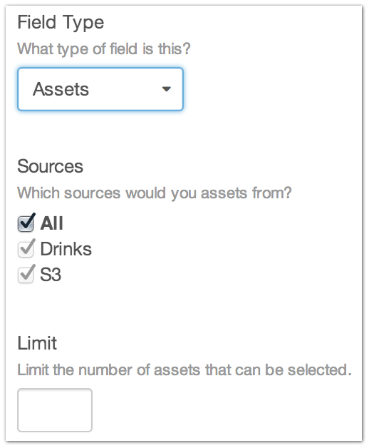
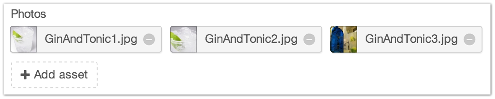
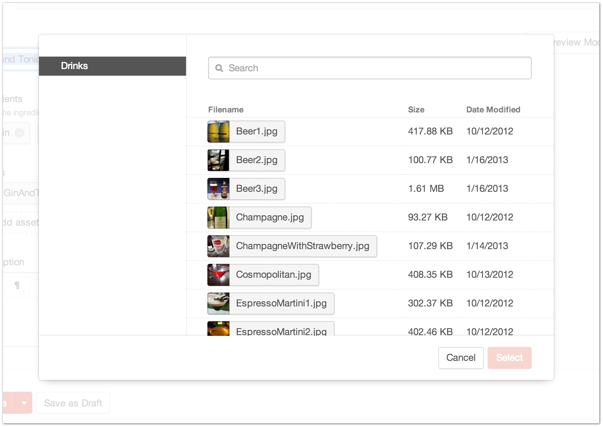

Assets
======

The Assets Field Type allows you to store and reference media content in Craft.  Assets can be used to store PDFs, images, movies, sound files, and other media types.

--------

Settings
--------

+------------+------------------------------------------------------------------------------------------------------+
| |settings| | Sources                                                                                              |
|            |    What sources will you choose Assets from?                                                         |
|            |    You can set up new Asset Sources in :doc:`Settings → Assets </diving-in/settings/content/assets>` |
|            |                                                                                                      |
|            | Limit                                                                                                |
|            |    Limit the number of selectable Assets                                                             |
+------------+------------------------------------------------------------------------------------------------------+

Entry Page
----------

Assets from the Edit Entry page allows you to see which Assets are currently associated with this entry.

You can also add new Assets to the current entry.

Template
----------

.. code-block:: html

    
        
    
