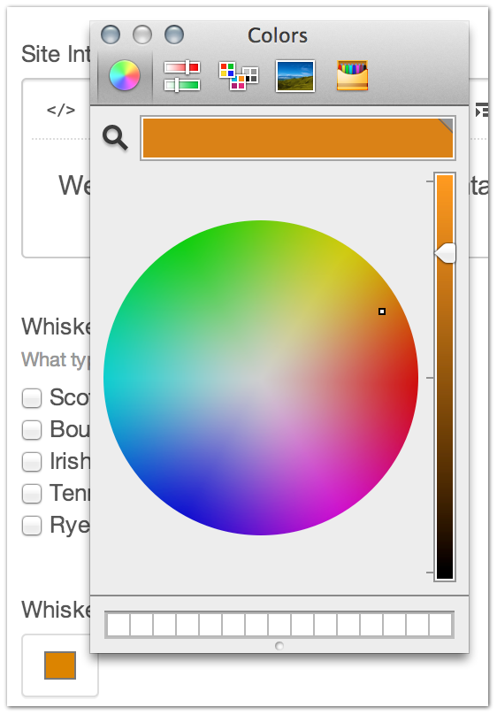

Color
=======

The Color Field Type will give you a color picker in your entry form.

In the template, this outputs as ``#ffffff``.

Use this anywhere that you need content-specific color settings.

--------

Settings
--------

This Field Type has no settings.

Entry Page
----------

+---------+-------------------------------------------------------+
| |color| | From the Entry page, you get a color picker where you |
|         | can select the desired color you want for this field. |
+---------+-------------------------------------------------------+

Template
----------

.. code-block:: html

	{{ entry.fieldHandle }}

