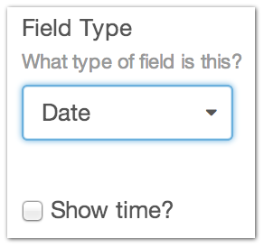
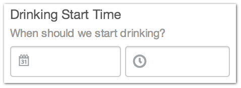
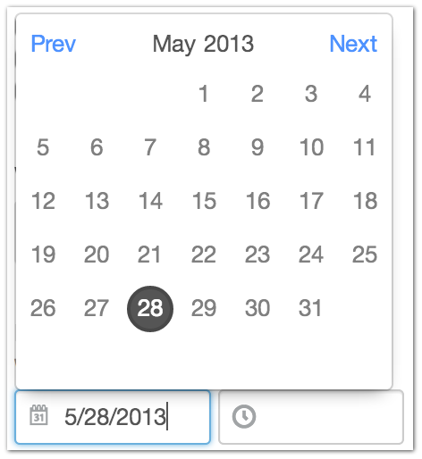
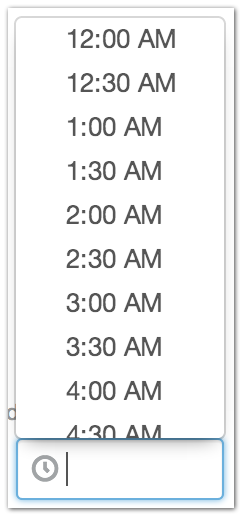

Date
====

If you need to store date and time information for your Entry, the Date Field Type has you covered.

There is an additional checkbox to show the time, or you may have the date only.

Dates and times are both formatted for display in the current user’s locale.

--------

Settings
--------

+------------+------------------------------------------------------------------------------------------------------+
| |settings| | Show time?                                                                                           |
|            |    Whether or not to show a separate time field along with the date.                                 |
+------------+------------------------------------------------------------------------------------------------------+

--------

Entry Page
----------

From the Entry page, you are give one or two field, depending on whether you checked ”Show time?” under the Field Type’s settings.

When you click in the date input, you’re given a calendar to choose a date from.

When you click in the time input, you’re given a time picker to choose a time from.

You can also manually type in the date and/or time for either of the fields.

--------

Template
--------

.. code-block:: html 

    {{ entry.date }}

Need to format your date?  See :doc:`date variable formatting </reference/templating/reference/variables/dates>` 

.. code-block:: html

    {{ entry.date.format('F j, Y') }}
