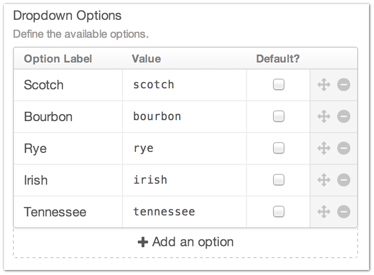
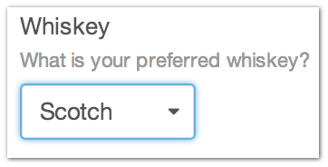

Dropdown
========

The Dropdown Field Type allows you to create a dropdown selector for your entry page.

You can set the Option Label, Value, if those items are the default, as well as drop and drop to re-order your options.

--------

Settings
--------

+------------+------------------------------------------------------------------------------------------------------+
| |settings| | Option Label                                                                                         |
|            |    The friendly display label for your Checkbox option                                               |
|            |                                                                                                      |
|            | Value                                                                                                |
|            |    The value that gets submitted when creating or editing an Entry                                   |
|            |                                                                                                      |
|            | Default                                                                                              |
|            |    Is this option selected by default when creating a new Entry?                                     |
+------------+------------------------------------------------------------------------------------------------------+

You can drag and drop your checkbox items to control the order they are presented in on the Entry page as well as delete them entirely with the controls in the far right column.

--------

Entry Page
----------

From the Entry page, you are given a dropdown list with the options you specified in the Field Type’s settings.

--------

Template
----------
