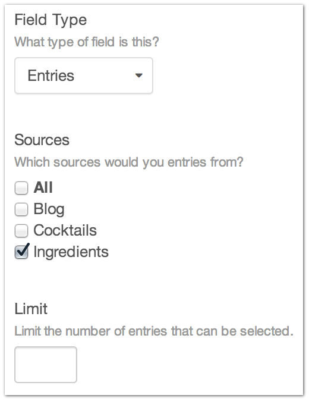
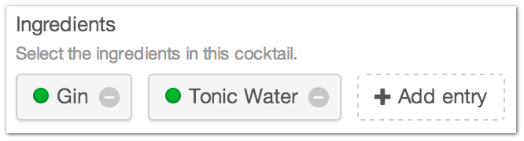
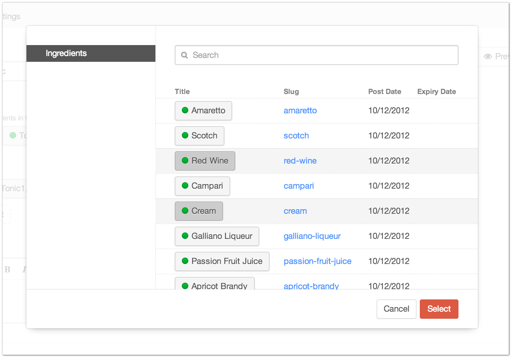

Entries
=======

Need to relate one entry to another?

How about relating multiple entries to each other?

The Entries Field Type has you covered.

--------

Settings
--------

+------------+------------------------------------------------------------------------------------------------------+
| |settings| | Sources                                                                                              |
|            |    What section(s) are related Entries located in?                                                   |
|            |                                                                                                      |
|            | Limit                                                                                                |
|            |    Limit the number of selectable Entries.                                                           |
+------------+------------------------------------------------------------------------------------------------------+

--------

Entry Page
----------

Entries from the Edit Entry page allows you to see what related Entries are currently associated with this entry.

You can also relate new Entries to the current entry.

--------

Template
--------

In the below code, ``blogEntries`` refers to the field handle for an entries field type.

.. code-block:: html

   
       <h2>{{ entry.title }}</h2>
           
               <ul> 
                   <li>{{ post.title }}</li>
               </ul>
           
   
