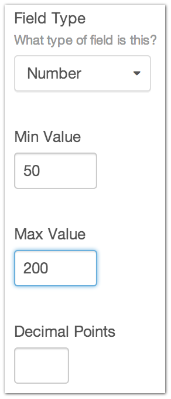
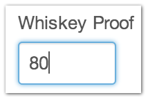

Number
=======

Need to store a number with your content?  Choose the Number field type!

This Field Type allows you to set the minimum and maximum values, and how many decimal points will be output in templates.

The user’s current locale is taken into account when displaying the numeric values in the correct format.

--------

Settings
--------

+------------+------------------------------------------------------------------------------------------------------+
| |settings| | Min Value                                                                                            |
|            |    Set the lowest number that may be entered on the Entry form                                       |
|            |                                                                                                      |
|            | Max Value                                                                                            |
|            |    Set the highest number that may be entered on the Entry form                                      |
|            |                                                                                                      |
|            | Decimal Points                                                                                       |
|            |    The max number of decimal points to output in the template                                        |
+------------+------------------------------------------------------------------------------------------------------+

--------

Entry Page
----------

It’s a text field.

You can enter a number.

--------

Template
--------

.. code-block:: html
    {{ entry.fieldHandle }}
