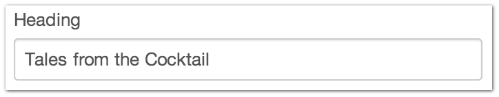

Plain Text
==========

The Plain Text Field Type allows you to create a simple textarea for storing content.

You can optionally set “Hint Text” that will be shown if the field doesn’t have a value on the entry page.

There are also optional settings to set a limit on the maximum number of words or characters allowed in the textarea as well as whether to allow line breaks in the textarea.

--------

Settings
--------

+------------+------------------------------------------------------------------------------------------------------+
| |settings| | Hint Text                                                                                            |
|            |    Text to help guide the Entries author when creating a new Entry                                   |
|            |                                                                                                      |
|            | Max Length                                                                                           |
|            |    The maximum number of characters or words than can be used in this field                          |
|            |                                                                                                      |
|            | Allow line breaks                                                                                    |
|            |    Whether or not to allow line breaks in this field                                                 |
+------------+------------------------------------------------------------------------------------------------------+

--------

Entry Page
----------

On the Entry page, you get a a simple text field for use.

--------

Template
--------
