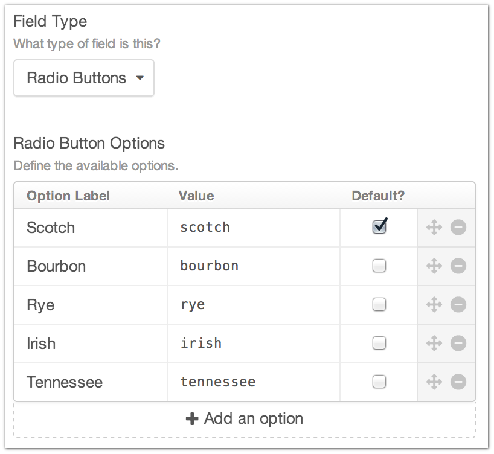
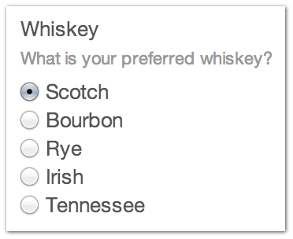

Radio Button
============

The Radio Buttons Field Type allows you to create a grouping of Radio Buttons to include on your Entry form.

You can set an Option Label, a Value, and check if that option is the default value.

You can also drag and drop your checkbox items to control the row order presented when modifying content.

--------

Settings
--------

+------------+------------------------------------------------------------------------------------------------------+
| |settings| | Option Label                                                                                         |
|            |    The friendly display label for your Checkbox option                                               |
|            |                                                                                                      |
|            | Value                                                                                                |
|            |    The value that gets submitted when creating or editing an Entry                                   |
|            |                                                                                                      |
|            | Default                                                                                              |
|            |    Is this option selected by default when creating a new Entry?                                     |
+------------+------------------------------------------------------------------------------------------------------+

You can drag and drop your Radio Button items to control the order they are presented in on the Entry page as well as delete them entirely with the controls in the far right column.

--------

Entry Page
----------

Your Radio Button Field Type will appear on your entry form with the options you created in the order you set them.

--------

Template
--------
