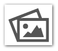
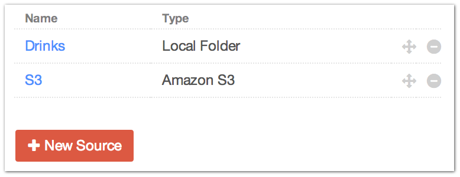
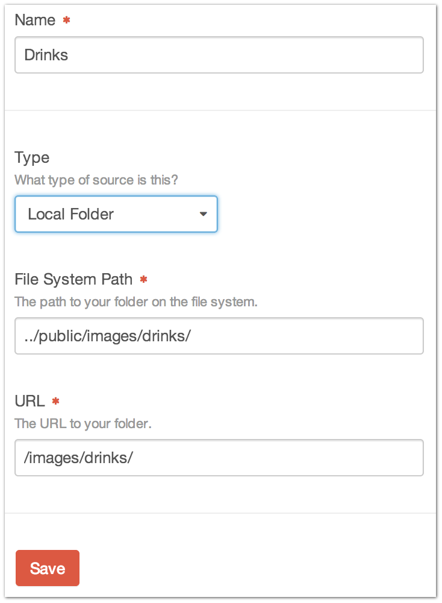
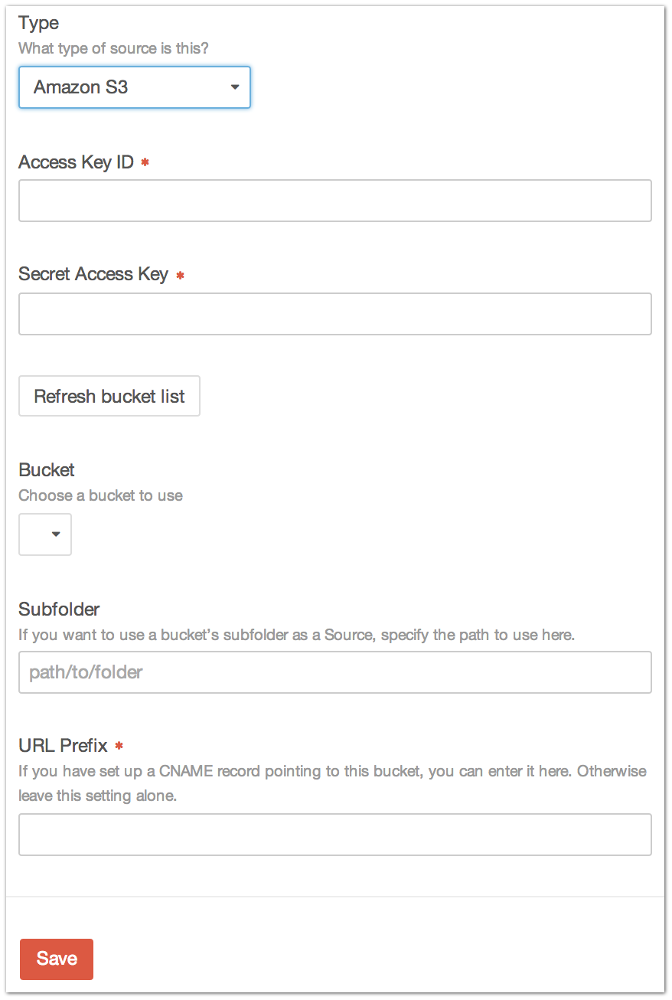
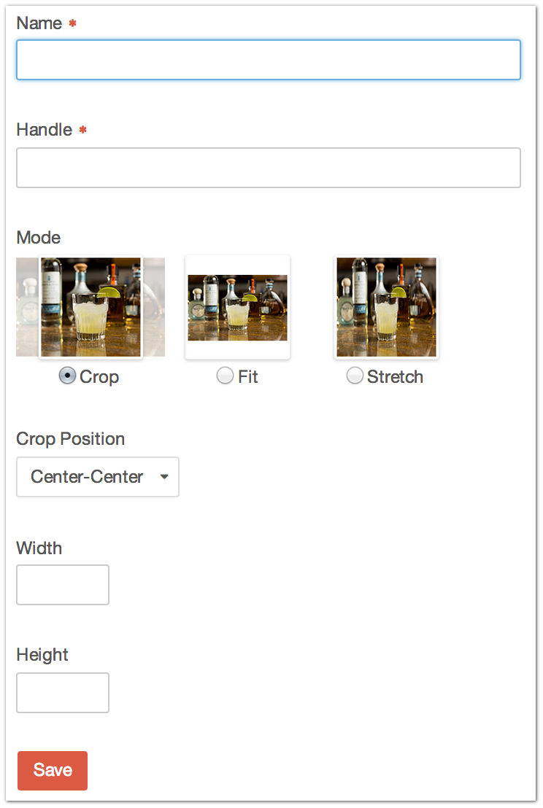

|icon| Settings → Assets
========================

The Settings → Assets page is where you administer all Assets related functionality of your site.

This includes creating and editing your Assets sources as well as defining Image Transforms.

--------

Asset Sources
-------------

An Asset Source is where a collection of Assets is located, whether it’s a local folder on the file system or based in the cloud.

A fresh Craft installation supports local Asset Sources only.

--------

**Local Source**

+---------------+--------------------------------------------------------------------------------------+
| |localsource| | Name                                                                                 |
|               |    The name of this Asset Source                                                     |
|               |                                                                                      |
|               | Type [1]_                                                                            |
|               |    The type of Asset Source this is.                                                 |
|               |    This will not even be visible unless you have the Cloud package installed.        |
|               |                                                                                      |
|               | File System Path                                                                     |
|               |    The path on the file system with your Assets. Can be a relative or absolute path. |
|               |    If it is relative, it is relative from the root of your ``craft/`` folder.        |
|               |                                                                                      |
|               | URL                                                                                  |
|               |    The URL to your folder (e.g. ``http://yourdomain.com/images/``)                   |
+---------------+--------------------------------------------------------------------------------------+

If you require any cloud-based storage solutions, then you’ll need the Cloud package, which supports `Amazon S3 <http://aws.amazon.com/s3/>`_, `Google Cloud Storage <https://cloud.google.com/products/cloud-storage>`_, and `Rackspace Cloud Files <http://www.rackspace.com/cloud/files/>`_

--------

**S3 Source**

+-------------------------------------------------------------------------------------------+------------+
| Access Key ID                                                                             | |s3source| |
|    Your Amazon S3 Access Key ID                                                           |            |
|                                                                                           |            |
| Secret Access Key                                                                         |            |
|    Your Amazon S3 Secret Access Key                                                       |            |
|                                                                                           |            |
| Refresh bucket list                                                                       |            |
|    Clicking this will retrieve your S3 buckets and list them under the “Bucket” dropdown  |            |
|                                                                                           |            |
| Subfolder                                                                                 |            |
|    If you want to use a bucket’s subfolder as a source, specify the path to use here      |            |
|                                                                                           |            |
| URL Prefix                                                                                |            |
|    If you have set up a DNS CNAME record pointing to this bucket, you can enter it here.  |            |
+-------------------------------------------------------------------------------------------+------------+

--------

Image Transforms
----------------

You can create pre-defined Image Transforms for your Assets.

+--------------+-------------------------------------------------------------------------------------------+
| |transforms| | Name                                                                                      |
|              |    The name of this Image Transform                                                       |
|              |                                                                                           |
|              | Handle                                                                                    |
|              |    How you’ll refer to this Image Transform in your templates                             |
|              |                                                                                           |
|              | Mode                                                                                      |
|              |    Whether to ``Scale and Crop``, ``Scale to Fit`` or ``Stretch to Fit`` the image        |
|              |                                                                                           |
|              | Crop Position                                                                             |
|              |    If ``Scale and Crop`` is selected, you can choose where on the image to apply the crop |
|              |                                                                                           |
|              | Width                                                                                     |
|              |    The target width of the image                                                          |
|              |                                                                                           |
|              | Height                                                                                    |
|              |    The target height of the image                                                         |
+--------------+-------------------------------------------------------------------------------------------+

If only a **Height** or a **Width** is given, the other value will be scaled appropriately.

Field Layout
-------------

Assets also get their own :ref:`field layout <fieldLayouts>`, which defines the custom fields that will be available for all Assets.

.. [1] Requires Cloud package
