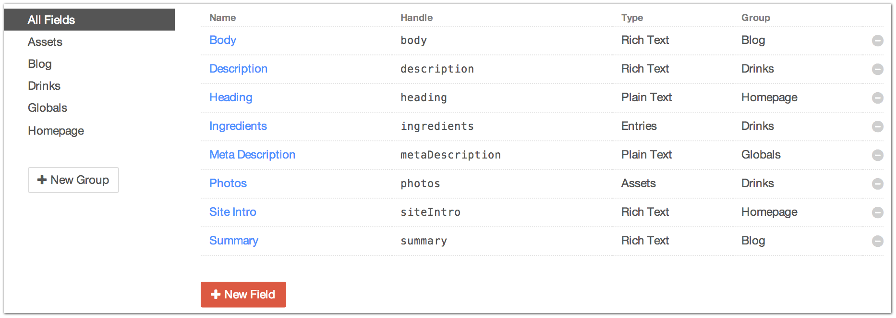
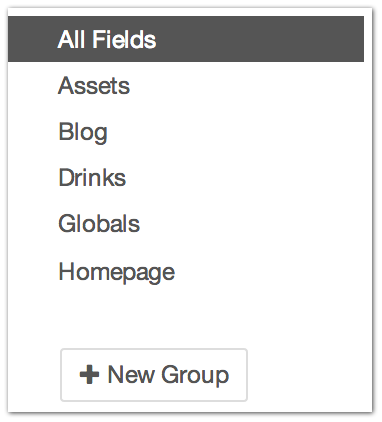
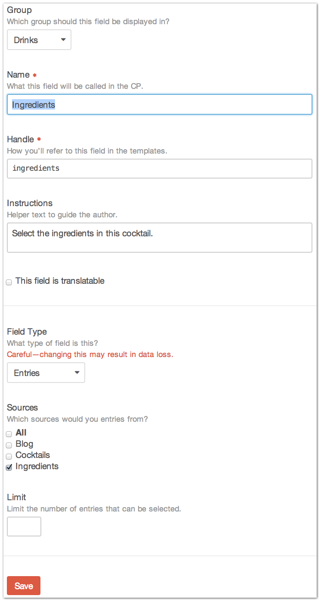

.. |icon| image:: ../../../_static/images/diving-in/settings/icons/fields.png
   :alt: Field Settings Icon
   :width: 50px
   :scale: 100%
   :align: middle

|icon| Settings → Fields
========================

The Settings → Fields page is where you administer the building blocks of your site… Fields.

Field Groups
------------

+---------------+------------------------------------------------------------------------------------------------------------------------------+
| |fieldgroups| | Field Groups are purely organizational grouping structures for your Fields.                                                  |
|               |                                                                                                                              |
|               | You can create new Field Groups by clicking the “New Group” button.                                                          |
|               |                                                                                                                              |
|               | You can view which Fields are in which Field Groups by clicking through the Field Groups listed in the left hand navigation. |
+---------------+------------------------------------------------------------------------------------------------------------------------------+

New Fields / Editing an Existing Field
----------------------------

+------------------
|
|
|
|
|
|
|
|
|
|
|
+--------------------
