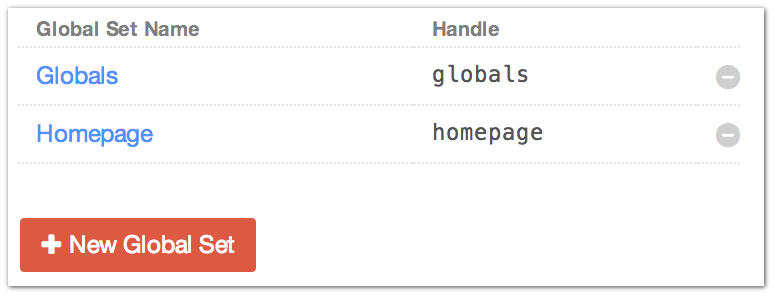
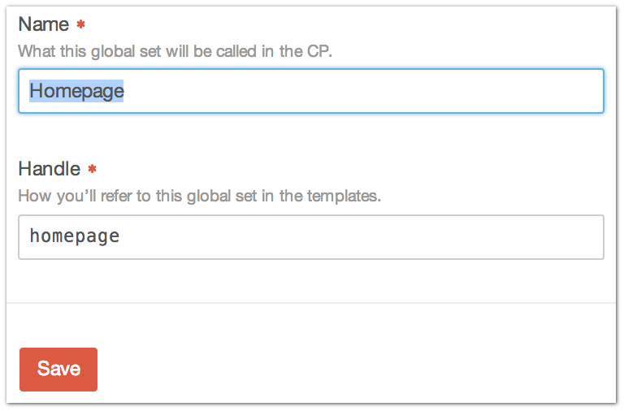

.. |icon| image:: ../../../_static/images/diving-in/settings/icons/globals.png
   :alt: Global Settings Icon
   :width: 50px
   :scale: 100%
   :align: middle

|icon| Settings → Globals
=========================

The Settings → Globals page is where you administer your site’s Globals.

--------

Settings
--------

+---------------+------------------------------------------------------+
| |globalsedit| | Name                                                 |
|               |    The name of the Global                            |
|               |                                                      |
|               | Handle                                               |
|               |    How you’ll refer to this Global in your templates |
+---------------+------------------------------------------------------+

--------

Field Layout
------------

Each Global also get it’s own :ref:`field layout <fieldLayouts>`, which defines the custom fields that are available to this Global.
