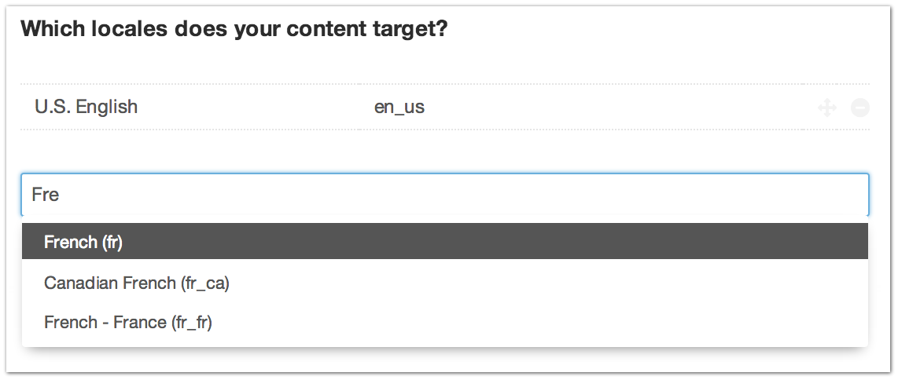

.. |icon| image:: ../../../_static/images/diving-in/settings/icons/locales.png
   :alt: General Settings Icon
   :width: 50px
   :scale: 100%
   :align: middle

|icon| Settings → Locales [1]_
==============================

The Settings → Locales page requires the Localization package to be installed.

You can add new locales that your site’s content will be targeting from here.

.. [1] Requires Localization package
