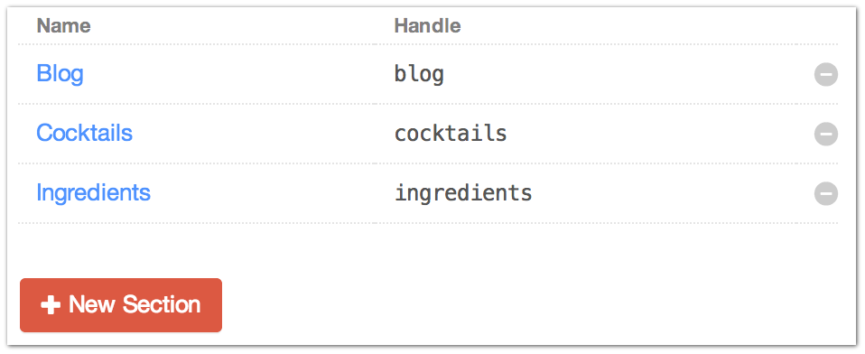
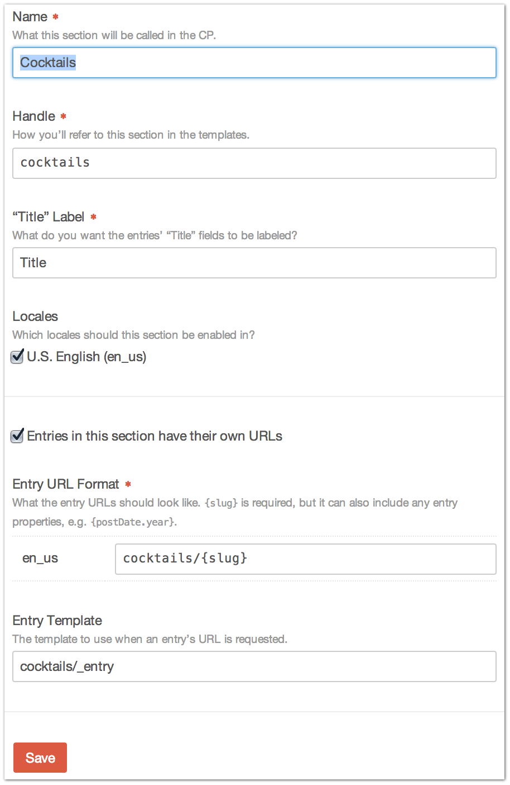

|icon| Settings → Sections
==========================

Each section defines the structure of the :doc:`entries <entries>` that belong to it, with its own set of fields tailored to the needs of the content, and its own URL format.

Without any packages, Craft allows you to have one section.

It's already created for you by default (“Blog”), but you can customize that if you'd like (perhaps you’d prefer “News” instead), or delete it altogether.

If the site also has a need for a “Case Studies” section, for example, you would need to purchase :doc:`/packages/publishpro` to enable multiple section support.

Settings
--------

+------------+-----------------------------------------------------------------------------------------------------------------------------------------+
| |settings| | Name                                                                                                                                    |
|            |     What this section will be called in the CP                                                                                          |
|            |                                                                                                                                         |
|            | Handle                                                                                                                                  |
|            |    How you'll refer to this section in the templates                                                                                    |
|            |                                                                                                                                         |
|            | “Title” Label                                                                                                                           |
|            |    What you would like the entries "Title" fields to be labeled                                                                         |
|            |                                                                                                                                         |
|            | Locales [1]_                                                                                                                            |
|            |    Which locales this section should be enabled in                                                                                      |
|            |                                                                                                                                         |
|            | Entries in this section have their own URLs                                                                                             |
|            |    Checkbox to indicate if entries can be accessed by their own URLs in the templates                                                   |
|            |                                                                                                                                         |
|            | Entry URL Format                                                                                                                        |
|            |    What the entry URLs should like like. ``{slug}`` is required, but it can also include any entry properties, e.g. ``{postDate.year}`` |
|            |                                                                                                                                         |
|            |    If the Localization package is installed, you can enter the URLs on a per-locale basis [1]_                                          |
|            |                                                                                                                                         |
|            | Entry Template                                                                                                                          |
|            |    The template to use when an entry's URL is requested.                                                                                |
+------------+-----------------------------------------------------------------------------------------------------------------------------------------+

**Entry URL Format** and **Entry Template** will only show up if you have opted to give entries in the section their own URLs.

Each section also gets its own :ref:`field layout <fieldLayouts>`, which defines which fields will be available to its entries.

.. [1] Requires Localization package
