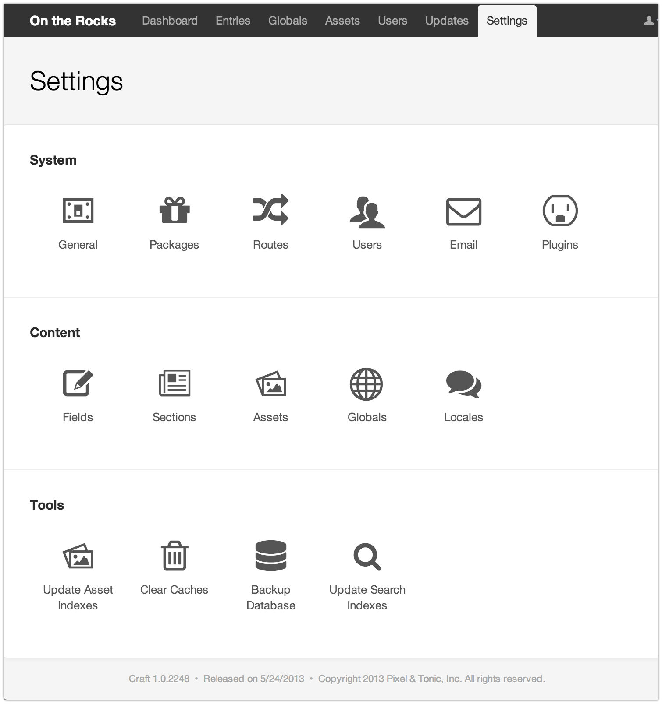

Settings
========

The Settings page is where all of Craft’s site administration happens.

Accordingly, only admins are allowed to access it.

``This works, but you lose the "TOC Navigation" that toctree provides.``

.. rst-class:: settings-table
+-----------------------------------------+---------------------------------------+---------------------------------------------------------------+
| **System**                              | **Content**                           | **Tools**                                                     |
|                                         |                                       |                                                               |
|  * :doc:`General <system/general>`      |  * :doc:`Fields <content/fields>`     | * :doc:`Update Asset Indexes <tools/update-asset-indexes>`    |
|  * :doc:`Packages <system/packages>`    |  * :doc:`Sections <content/sections>` | * :doc:`Clear Caches <tools/clear-caches>`                    |
|  * :doc:`Routes <system/routes>`        |  * :doc:`Assets <content/assets>`     | * :doc:`Backup Database <tools/backup-database>`              |
|  * :doc:`Users <system/users>`          |  * :doc:`Globals <content/globals>`   | * :doc:`Update Search Indexes <tools/update-search-indexes>`  |
|  * :doc:`Email <system/email>`          |  * :doc:`Locales <content/locales>`   |                                                               |
|  * :doc:`Plugins <system/plugins>`      |                                       |                                                               |
|                                         |                                       |                                                               |
+-----------------------------------------+---------------------------------------+---------------------------------------------------------------+

--------

``toctree apparently doesn't work inside of tables.  Giving up on trying to get these to align left to right.``

System
------

.. toctree::
   :titlesonly:

   General <system/general>
   Packages <system/packages>
   Routes <system/routes>
   Users <system/users>
   Email <system/email>
   Plugins <system/plugins>

Content
-------

.. toctree::
   :titlesonly:

   Fields <content/fields>
   Sections <content/sections>
   Assets <content/assets>
   Globals <content/globals>
   Locales <content/locales>

Tools
-----

.. toctree::
   :titlesonly:

   Update Asset Indexes <tools/update-asset-indexes>
   Clear Caches <tools/clear-caches>
   Backup Database <tools/backup-database>
   Update Search Indexes <tools/update-search-indexes>
