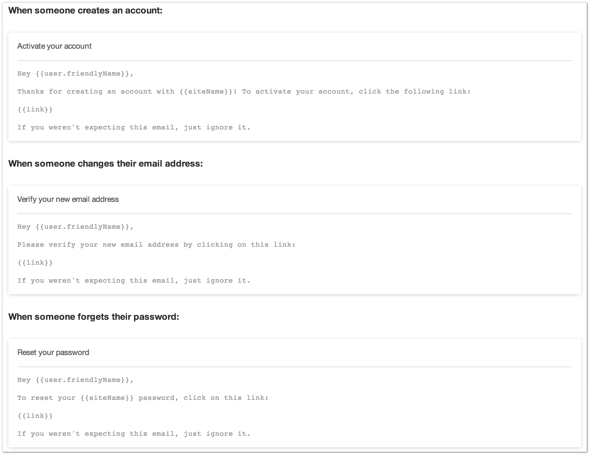

|icon| Settings → Email
=======================

Craft needs some basic email information for its outgoing emails.

--------

Settings
--------

System Email Address
    The email address Craft will use when sending email.

Sender Name
    The “From” name Craft will use when sending email.

HTML Email Template [1]_
    When sending an HTML email, Craft will use this template.

Protocol
    The protocol to use when sending an email.

    Craft uses PHPMail as the default, however, you can choose from Sendmail, SMTP, POP or Gmail for sending emails.

--------

Messages [1]_
-------------

If you have the Rebrand package installed, you can customize the default email templates that Craft uses to send emails for such activities as account activation emails, forgotten password emails, etc.

In addition to that, if you have the Localization package installed, you will get an addition locales dropdown menu where you can customize these messages on a per locale basis. [2]_

.. [1] Requires Rebrand package
.. [2] Requires Localization package
