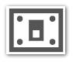
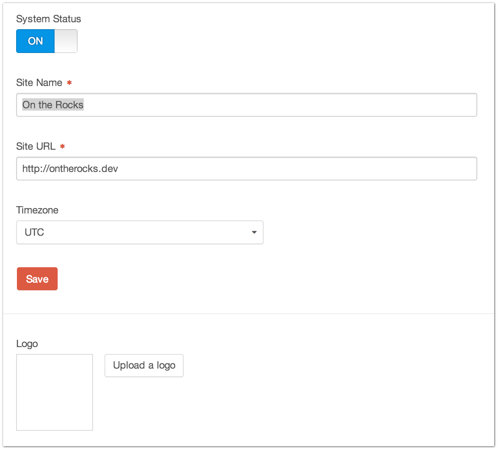

|icon| Settings → General
=========================

The Settings → General page is where you can administer some basic, site-wide settings.

--------

System Status
    Turns your Craft system ``On`` and ``Off``.

    If Craft is ``Off``, then visitors to the front-end of the site will get a “Site Offline” page unless they have an authenticated session with ``accessSiteWhenSystemIsOff`` permissions.

Site Name
    The name of your site.  It is displayed in the upper-left corner of the Control Panel as well as used in the default email templates for account registration, forgotten passwords and such.

Site URL
    The URL of the site.  Used when generating URLs throughout the system.

Timezone
    Your site’s primary timezone.  This is used to display correct times across timezones.

Logo [1]_
    If you have the Rebrand package installed, you can upload a logo for your site here that will be displayed on the Control Panel’s login page.

.. [1] Requires Rebrand package
