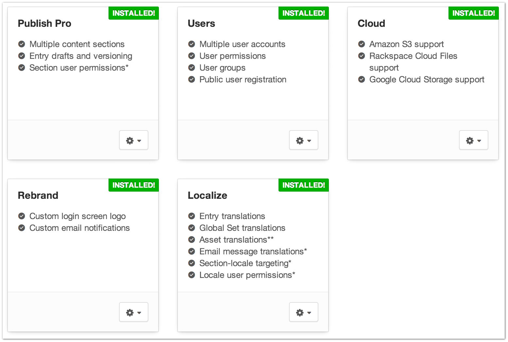

|icon| Settings → Packages
==========================

The Packages page is where you can go to manage Packages for your site including:

* The ability to purchase packages through our secure, in-app, package purchasing system. (link to secure purchase article)
* The ability to start 30-day, free trials of all of Craft’s package. (What happens when my trial expires?)
* The ability to install and uninstall already purchased packages.

--------

