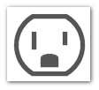
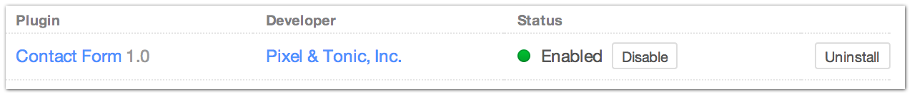

|icon| Settings → Plugins
=========================

The Settings → Plugins page is where you manage the plugins used by your site.

You can install, uninstall, enable or disable a plugin from this page.

Uninstalling a plugin is destructive to any data it might be storing in the database.

Disabling a plugin leaves the plugin’s data in the database, but just disables it’s functionality.

