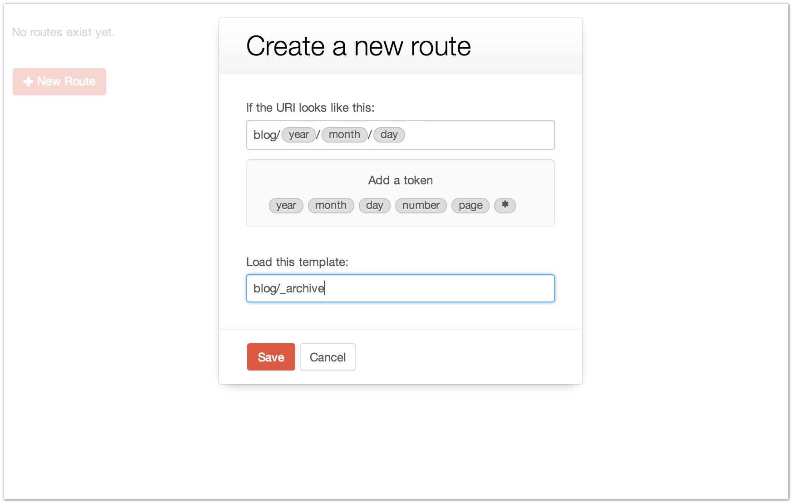

.. |icon| image:: ../../../_static/images/diving-in/settings/icons/routes.png
   :alt: Route Settings Icon
   :width: 50px
   :scale: 100%
   :align: middle

|icon| Settings → Routes
========================

The Settings → Routes page is where you can go to create and manage custom Routes (link to Routes explanation) for your site.

--------
