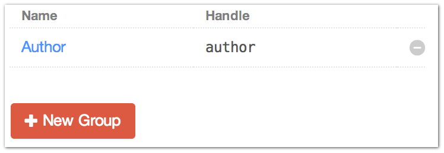
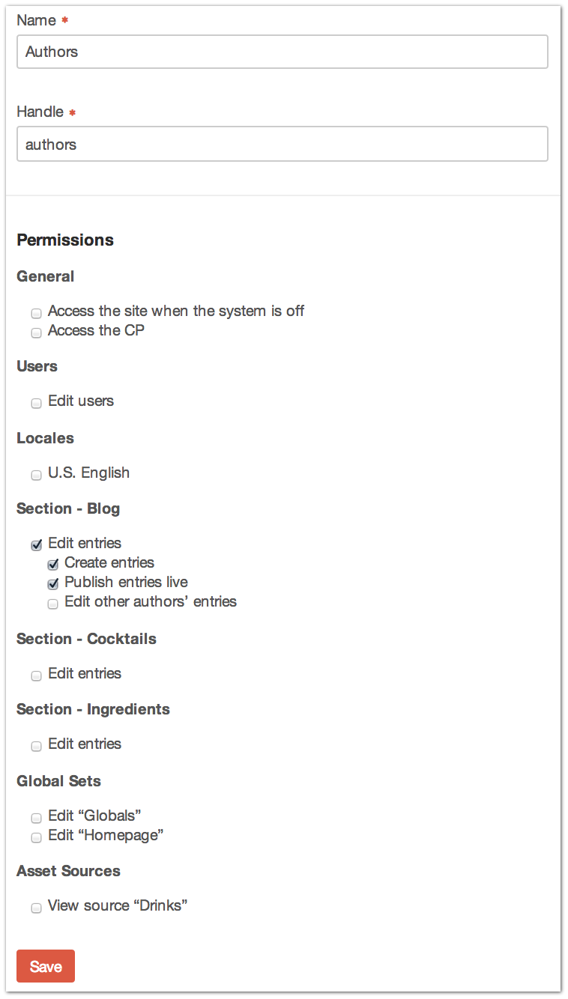
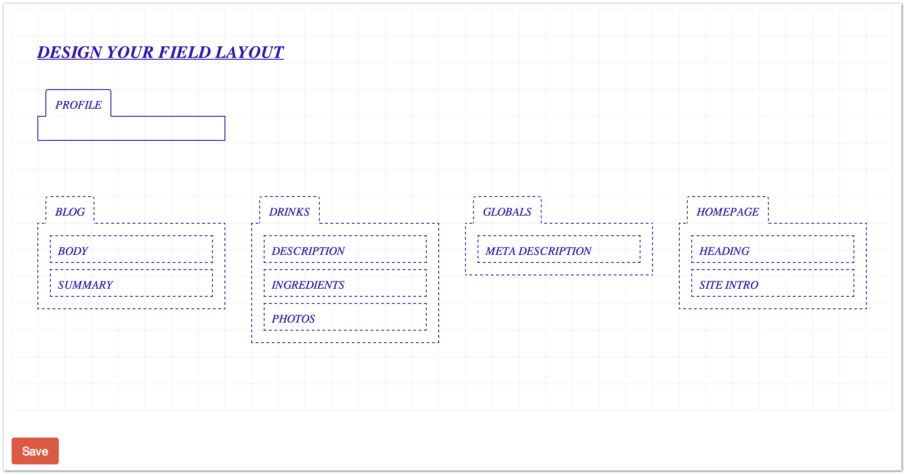
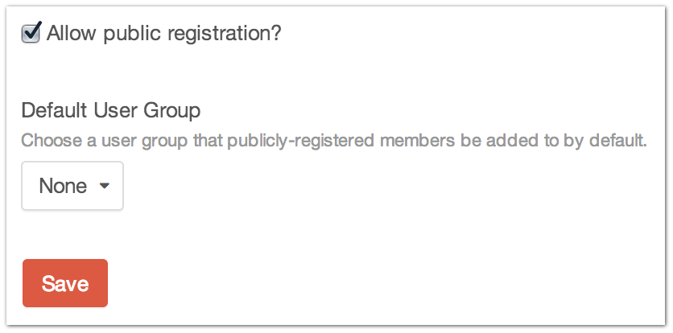

|icon| Settings → Users [1]_
============================

The Settings → Users page requires the Users package be installed.

It is the central place to manage User Groups and permissions for your site, to assign custom Fields to your Users and to edit site-wide settings that affect all Users.

--------

User Groups
-----------

View, edit and delete your existing User Groups from the main page.

When you’re ready to create a new User Group, click the “New Group” button.

+--------------+------------------------------------------------------------------------------------------------------+
| |usergroups| | You’ll need to provide a few bits of information for a new User Group.                                |
|              |                                                                                                      |
|              | Name                                                                                                 |
|              |     The name of the User Group                                                                       |
|              |                                                                                                      |
|              | Handle                                                                                               |
|              |     The handle for the User Group.  You can refer to the User Group in a template with this handle.  |
|              |                                                                                                      |
|              | Permissions                                                                                          |
|              |     Select the permissions you would like this User Group to have.                                   |
|              |                                                                                                      |
|              |     Some permissions are nested and won’t reveal themselves until the parent is checked.             |
+--------------+------------------------------------------------------------------------------------------------------+

--------

Fields
------

Under the Fields tab, you can assign any custom Fields to your Users.  These will show up in their User Profiles page.

--------

Settings
--------

Allow public registration?
    Whether or not to allow User registration from the front-end of your site.

    If checked, you’ll need to provide your own membership templates for account creation, editing, forgotten passwords, etc.

Default User Group
    The User Group that newly created accounts will be placed in by default.

.. [1] Requires Users package to be installed
