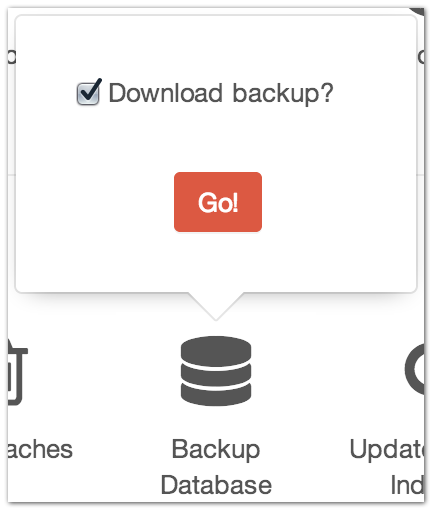

.. |icon| image:: ../../../_static/images/diving-in/settings/icons/backupdatabase.png
   :alt: Backup Database Settings Icon
   :width: 50px
   :scale: 100%
   :align: middle

|icon| Settings → Backup Database
=================================

You’re about doing to something crazy with your site and you’re really not sure if it’s going to work.

Do yourself a favor and click this button first.

The backup file will be placed on your ``craft/storage/backups/`` folder.

If you check “Download backup?”, it will be sent to your browser as well.
