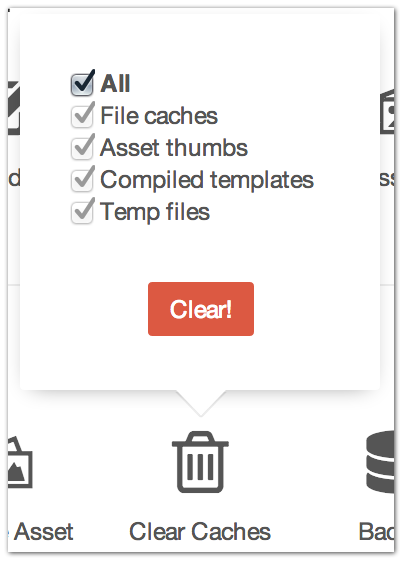

|icon| Settings → Clear Caches
==============================

It’s the equivalent of rebooting your computer to try and fix a problem and sometimes… that’s all it takes.

Select the folders you want to clear, click “Clear” button and rest peacefully know that all incriminating evidence against you has been destroyed.
