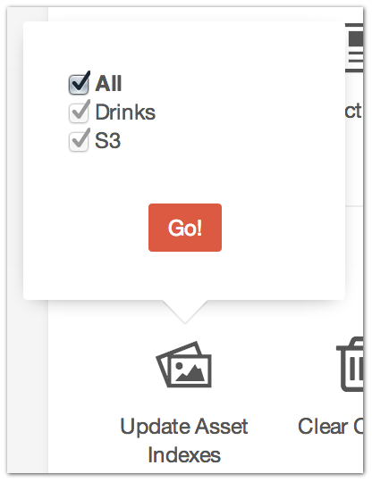

.. |icon| image:: ../../../_static/images/diving-in/settings/icons/assets.png
   :alt: Update Asset Indexes Settings Icon
   :width: 50px
   :scale: 100%
   :align: middle

|icon| Settings → Update Asset Indexes
======================================

Sometimes you need to tell Craft about new Assets that it might not know about already and this is where you two can have that conversation.

Select the Asset Sources you want to (re)index, click the “Go” button and sit back and relax.
