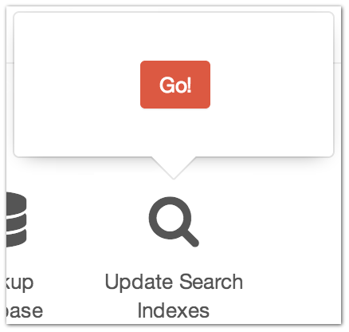

.. |icon| image:: ../../../_static/images/diving-in/settings/icons/updatesearch.png
   :alt: Update Search Index Settings Icon
   :width: 50px
   :scale: 100%
   :align: middle

|icon| Settings → Update Search Indexes
=======================================

Search isn’t returning the results you’re expecting?  Try re-populating your search indexes with this tool first.

This isn’t complicated… Click the “Go” button.
