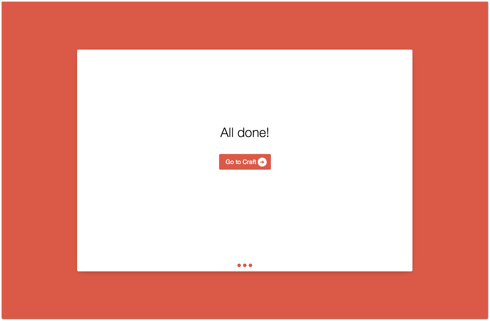

Installing and Updating Craft
=============================

What You’ll Need
----------------
There are a few basic things we’ll need before we start *Craft*-ing.

* Access to your web server via FTP or shell
* A text editor
* An FTP client
* A web browser

Preparing to Install
--------------------
Let’s get Craft up and running.

1.  Ensure that you and your web host meed the :doc:`minimum requirements <requirements>` to run Craft.
2.  Using your favorite database client, create a database for Craft as well as a MySQL user who has the :doc:`necessary permissions <requirements>` for Craft to run.

    .. container:: tip

       We recommend you set the default database charset to “utf8” and collation to “utf8_unicode_ci”.

3.  Download the latest version of Craft from `http://buildwithcraft.com <http://buildwithcraft.com>`_
4.  Unzip your newly acquired Craft.zip with your favorite zip utility.
5.  Open up your newborn Craft files, navigate to ``Craft/craft/config/db.php`` and open with your favorite text editor.

    This file is used to tell Craft how it can connect to your database.  For some of these values, you may need to check with your web host to get the correct ones.

    * Set ``server`` to the name of your database server.  If you are installing locally or your database and web server are on the same server, then this will likely be ``localhost`` or ``127.0.0.1``
    * Set ``user`` to the name of the MySQL user you created in step 3.
    * Set ``password`` to the password you set for the MySQL user you created in step 3.
    * Set ``database`` to the name of the database you created in step 3.

.. container:: tip

    If you are limited to one database, don’t worry!  You can still install Craft.  Just make sure the ``tablePrefix`` setting is set to a unique value that nothing else in your database is using.  It defaults to ``craft``.

6.  Save your db.php file.

7.  Upload the Craft/craft folder to a location that is above web root on your web server.  For example, if your web root is ``/users/bob/public_html/``, then the craft folder would go in ``/users/bob/craft``.

    Upload the contents of the Craft/public into the web root of your server.  In the previous example, it would be ``/users/bob/public_html``.

    .. container:: tip

       Make sure your FTP client is set to upload files in ASCII format.

8.  If you’re using Apache, rename the ‘htaccess’ file to ‘.htaccess’ and delete the ‘web.config’ file in the directory you just uploaded the Craft/public folder contents to.If you’re using IIS, just delete the ‘htaccess’ file.

9.  Set the craft/storage/ folders’ permissions to 777.

    To determine the proper permissions for the craft/config/ folder, you'll need to look at the relationship between the user that Apache/PHP is running as and the user who actually owns the craft/config folder.

    Here are some recommended permissions depending on that relationship:

    * If they are the same user, use 744.
    * If they're in the same group, then use 774.
    * Otherwise, use 777.

    .. container:: tip

    In IIS, make sure the account your site’s AppPool is running as has write permissions to this folder.

10. Now that everything’s uploaded and configured, you should be able to point your browser to ``http://yourdomain.com/admin`` and see the Craft installer.

    .. container:: tip

    *Note:* If /admin is giving you a 404, your server might not be configured to redirect would-be 404’s to index.php correctly. Try going to /index.php/admin or /index.php?p=admin instead.

The Installer
-------------

If you see this in your browser, you've done everything right so far.

Now, let’s create the first administrator account.  Be sure to pick a strong password!

Craft will try it’s best to guess your “Site Name” based on the current URL.  If it’s not exactly what you want, now is the time to change it.

If you have installed Craft into a subdirectory (i.e. ``http://domain.com/craft``), be sure to adjust the “Site URL” field to reflect that.

Click the “Finish up” button and let the installer do it’s thing.

.. image:: images/install3.png
    :width: 90%
    :scale: 100%
    :align: center
    :alt: Craft Install Site Creation Page

Seconds later, you should have a working Craft install!

Click “Go to Craft” and you’ll get taken straight to the dashboard.

Welcome to Craft!
-----------------

One-click Updating
------------------

Craft’s CP has an “Updates” tab where you can check if a new update is available, and update Craft with one click.

You also have the option of downloading the update, if you’d prefer to install it :ref:`manually <manuallyUpdating>`.

For one-click updates to work, Craft needs to be able to write to the craft/app/ folder, either via user or group-level permissions.

.. container:: tip

  For more detailed information on auto-updating including troubleshooting tips for any issues that might arise, check out :ref:`updatingInDepth`.

.. _manuallyUpdating:

Manually Updating
-----------------

Updating Craft manually is as simple as replacing your old craft/app/ folder with the new one. If you’re manually updating a live site, we recommend you follow these instructions to minimize the time your site is down:

#. Rename the craft/app/ folder in the release to “app-new”.
#. Upload craft/app-new/ to your server’s craft/ folder.
#. Once app-new/ is done uploading, rename craft/app/ to craft/app-old/ on your server.
#. Rename craft/app-new/ to craft/app/ on your server.
#. Point your browser to your Craft control panel. You will be prompted to proceed with a database update. Click “Finish up” and let the database updates run.

.. container:: tip

  For more detailed information on manual updating including troubleshooting tips for any issues that might arise, check out :ref:`updatingInDepth`.
